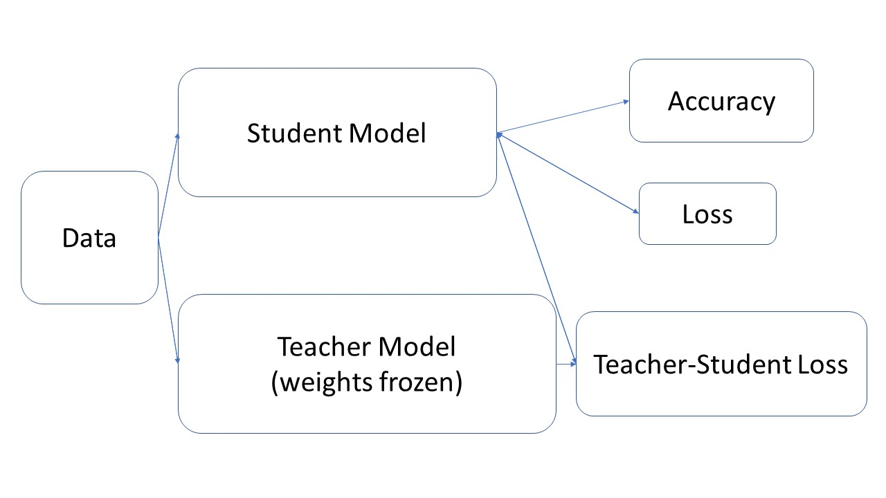
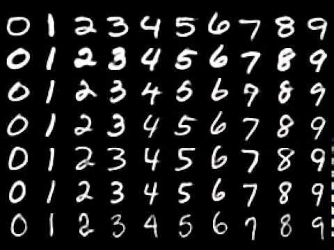
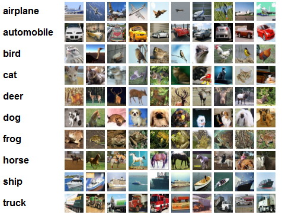
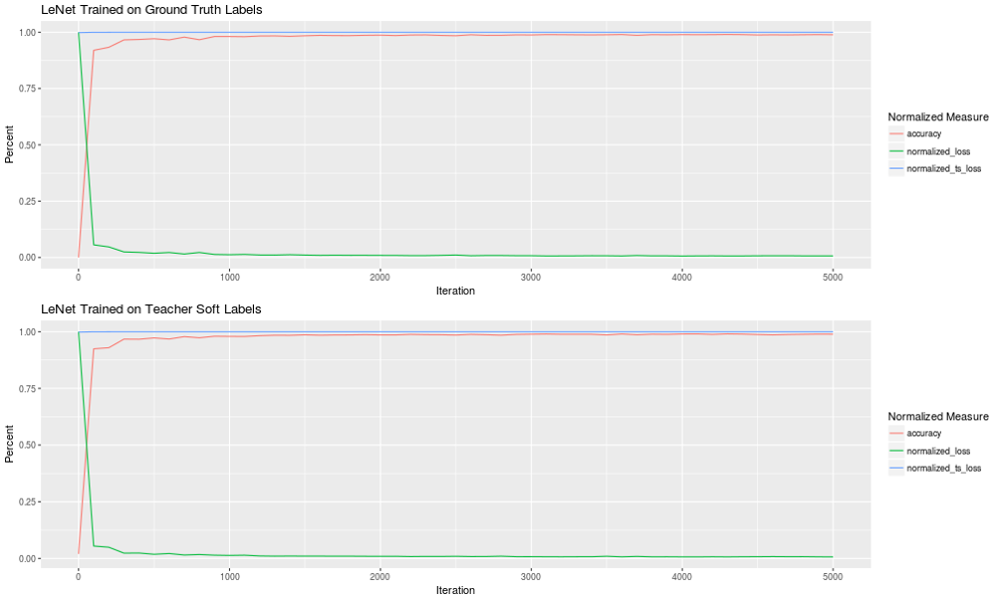
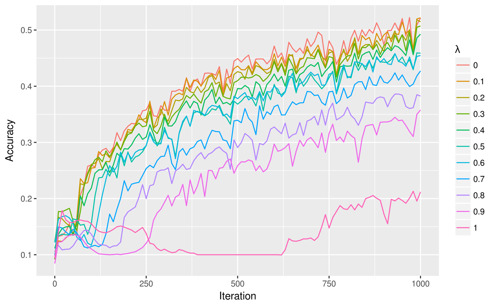
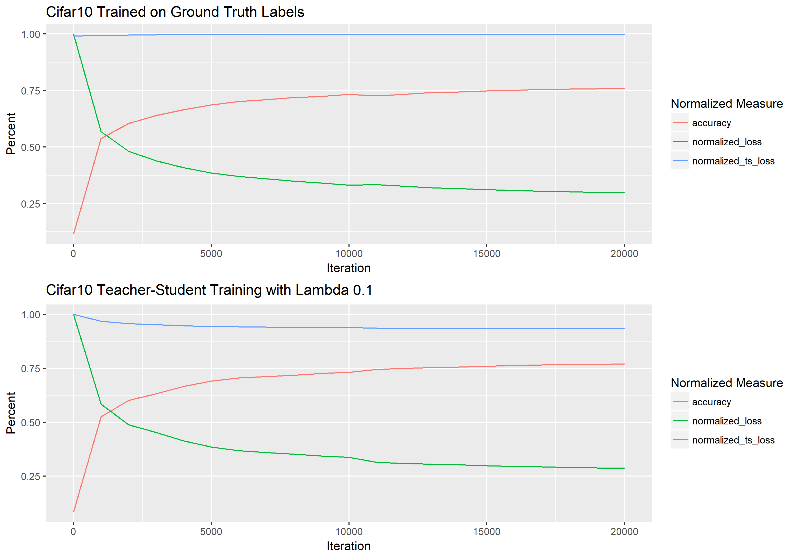
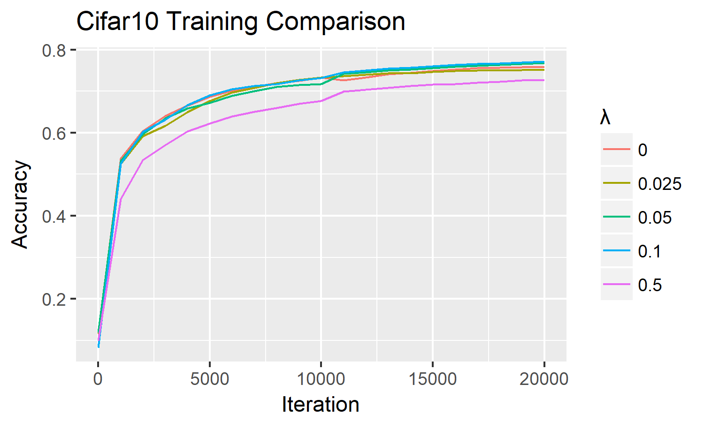
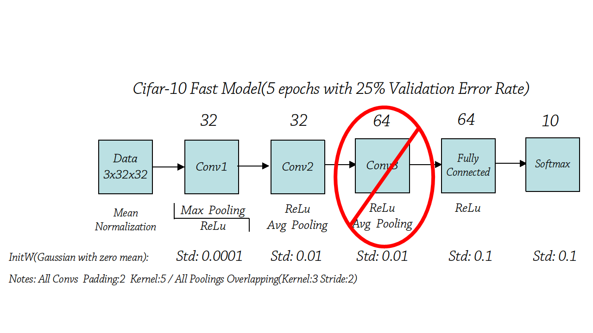
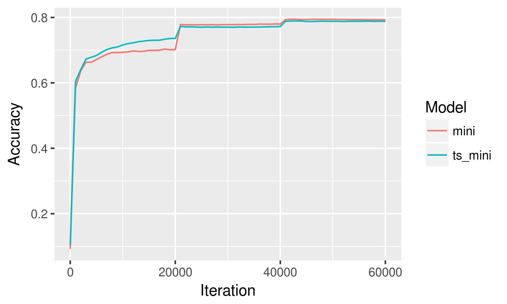

```{r setup, include=FALSE}
knitr::opts_chunk$set(echo = TRUE)
```
```{r echo=FALSE}
library("purrr")
```

Executive Summary
----

This repository stores the files used for my summer internship's work on "teacher-student learning", an experimental method of training deep neural networks. My results show that teacher-student learning is doable in concept, but the performance is inferior to that of neural networks which are trained normally. I tentatively push the claim that teacher-student learning can be used as a supplement to model initialization rather than as a standalone training tool. However, no definitive conclusions can be drawn because many of the approaches taken were naive, and many open questions remain.

Introduction to Teacher-Student Learning
----
Teacher-student learning adds a loss function measuring the divergence of the student model's probability distribution from the probability distributions generated by a teacher model. A comparison between a teacher probability distribution, or "soft label", and the one-hot encoded hard labels traditionally used to train neural networks is shown below.


```{r echo=FALSE}
labels <- c("Panther", "Cat", "Truck", "Goose")
hard_label <- c(1, 0, 0, 0)
soft_label <- c(0.7, 0.28, 0.015, 0.005)
dim_names <- list(c("Hard Labels", "Soft Labels"), labels)
label_comparison <- rbind(hard_label, soft_label)
dimnames(label_comparison) <- dim_names
label_comparison
```


Currently, training set images, such as this picture of a panther, are labeled using one-hot encoding, which assigns a value of 1 to the correct class, and a value of 0 to all other classes. An interpretation of one-hot encoding is that the correct class (panther) is assigned a 100% probability of being true, and all other classes are assigned a 0% probability of being true.

When passed through a softmax function, the output of a neural network could also be interpreted as a probability distribution. The soft label above implies there is a 70% chance the image shows a panther, a 28% chance that it shows a cat, a 1.5% chance that it shows a truck, and a 0.5% chance that it shows a goose.

By using this soft label in place of the ground truth hard label, it is possible to take advantage of the "dark knowledge" present in the probability distribution. First presented in the 2015 paper, "Distilling the Knowledge in a Neural Network" by Hinton et al., dark knowledge is the hypothesis that the probability distribution of the soft label imparts more information an untrained student model can learn from than a hard label, because the soft label implies some false categories are much less likely than others. In the example, the image data does not represent either a cat, truck, or goose, but it is clear to a human that the picture is more like a cat than a truck or a goose. The soft label, which implies the image is nearly 20 times more likely to be a cat than a truck, carries information about the relationships between classes, which a hard label cannot impart. 

Business Use Cases
----

Apart from theory, there is a lot of practical potential in teacher-student learning:

1) Data Flexibility. With a powerful teacher model, new training data no longer needs to be assigned hard labels. Having a trained teacher model to label new data could make training models from scratch much easier, with their soft labels having more information than if they were converted to hard labels by taking the top-1 probability of the probability distribution. Data scarcity is especially a problem in industry, where many companies are willing to release trained models, but not the proprietary data used to train them. With teacher-student training, replicating these trained models becomes a possibility.

2) Model Compression. Neural networks are heavily constrained by their architecture during training, and the simplest way to get better classification performance with a neural net is to stack more layers. Yet when looking at a freshly trained model, it is entirely possible to find that 40% of the neurons in the network are "dead", in that they never fire no matter the data input! Thus, a good decision surface might require a large network to learn, but once learned, the decision surface can be expressed using a much smaller network. A smaller student model trained using a larger teacher's soft labels might be able to learn faster and get better performance than it could learn using only hard labels. Deploying a smaller network which exhibits performance extremely close to a much larger teacher model could help companies realize large cost savings in computation-related costs. Moreover, neural networks could be deployed on smaller devices, such as laptops or even mobile phones. Enabling neural network processing to be done locally on consumer devices would create a new market for advanced natural language and image processing apps, which are infeasible using current technology.

3) Model blending. Discussed in a 2016 paper, "Blending LSTMs into CNNs" by Geras, model blending is an alternative to model ensembling, where the outputs of a large amount of models are combined together (usually through voting) into a single score, model blending aims to combine the insights of all models in the ensemble into a single model through teacher-student training. Model blending would also function as a sort of model compression, enabling businesses to push state-of-the-art models into deployment with marked performance improvements. The Geras paper shows how a convolutional neural network (CNN), traditionally used for image classification, can surpass its Long Short-Term Memory (LSTM) teacher on natural language processing, something the LSTM architecture has a natural advantage in. Giving businesses the power to harness the power of ensembling without the enormous computational overhead of running multiple models in tandem could give them more power to accurately classify, target, and make recommendations to potential customers.

The work that follows is an attempt to verify the many claims of teacher-student training.

Infrastructure
----
Neural network training was done using the optimized deep learning library, Caffe. When investigating and debugging the neural network, Python was used as an interface to Caffe. Modeling was done using NVIDIA GPUs on computers running Ubuntu. Because the method used to conduct teacher-student training was extremely GPU-memory intensive, later work was done using the Amazon Web Services infrastructure, although the software and hardware used remained essentially the same.

Methodology
----
The basic idea behind setting up teacher-student modeling is straightforward. Caffe stores models in .prototxt files using the Google protobuf format, which defines the neural network layer by layer. Layers are connected to each other by specifying their "bottoms" and "tops"; the bottom is the data the layer takes in, and the top is the data the layer puts out. Below is an example of a convolution layer defined using the Google protobuf format:
```{r eval=FALSE}
layer {
  name: "conv_s2"
  type: "Convolution"
  bottom: "pool_s1"
  top: "conv_s2"
  param {
    lr_mult: 1.0
  }
  param {
    lr_mult: 2.0
  }
  convolution_param {
    num_output: 50
    kernel_size: 5
    stride: 1
    weight_filler {
      type: "xavier"
    }
    bias_filler {
      type: "constant"
    }
  }
}
```
The convolution layer is named "conv_s2", and takes in the data blob which has been labeled as "pool_s1". The convolution layer outputs data which is labeled as "conv_s2". The rest of the code specifies parameters for the convolution layer.

In this manner, a model can be defined by connecting each layer to the next. Teacher-student training sets up both the teacher and the student models in the same .prototxt file. Though the layers of both models are present in the same file, they are only connected in two places: at the beginning data layer, and at the final teacher-student cross-entropy loss function layer. Examples of teacher-student model .prototxt files can be found in the cifar10, mnist, and imagenet folders.



The .prototxt file specifies the structure of the model; pretrained model weights must be loaded in through a .caffemodel file. The .caffemodel file loads the weights of its layers to the corresponding layer of the same name in the .prototxt file. This means that the teacher layers must have the same names as the .caffemodel layers, and the student layers must have names that are different from the .caffemodel layers. Layers whose names do not show up in the .prototxt file are not loaded, allowing us to pick and choose which layers are loaded.

The load_model_weights.py script in the scripts folder provides a short code snippet used to map .caffemodel files using the canonical layer names to .caffemodel files with custom layer names. Using custom layer names allow us to avoid duplicate name issues when loading in weights from multiple teachers into a teacher-student model. 

Note that when running the script, the .prototxt files used to define the model structures must all draw their training data from different file sources, or else Ubuntu will freeze. Thus, when loading in two models, one .prototxt file will set its TRAIN phase to get its data from the validation source and the other will get data from the training source. 

Performance Metrics
----
Neural networks measure their performance on a validation dataset using two performance metrics: the loss and the accuracy. The loss is the average value reported by the network's loss function over all the data points tested during the validation phase, while the accuracy is the proportion of correct predictions made by the model. Teacher-student training adds another loss function, the cross-entropy loss between the student and teacher soft labels. A shrinking teacher-student loss suggests that the student model's decision surface is converging to that of the teacher's.

It should be noted that in general, the teacher-student loss is much greater than that of the normal cross-entropy loss. The cross-entropy of the hard label, which uses one-hot encoding, only has one nonzero loss term, while the cross-entropy between two different loss terms will only have nonzero loss terms. Thus, the teacher-student loss is typically given a lower loss weight during training.

Datasets
----
Three datasets were used to test teacher-student training. In order of complexity, they are MNIST, CIFAR10, and Imagenet 2012.

MNIST



The MNIST dataset contains 60,000 training images and 10,000 validation images. Each image is a grayscale picture of a handwritten number, and the image has height and width dimensions of size 20. There are 10 classes in total, one for each digit. MNIST is a simple and small dataset, allowing models to easily and quickly converge. These properties make MNIST the dataset of choice for testing proofs of concept for image-based networks.

CIFAR10



Like MNIST, CIFAR10 also has 60,000 training images and 10,000 validation images grouped into 10 classes. However, the images have heights and widths of 32 by 32, and three color channels (red, green, blue). 

Imagenet 2012
Containing 1.2 million training images and 50,000 validation images split into 1000 classes, Imagenet is a massive dataset used to display state-of-the-art models. Unfortunately, several attempts to train the VGG16 model used on Imagenet using both normal and teacher-student training were unsuccessful. Imagenet, however, continues to be of great interest for future research into teacher-student learning.

Proof of Concept on MNIST
----
Teacher-student training was first attempted using two LeNets on the MNIST database; one LeNet was loaded with trained weights, while the other was randomly initialized. The structure of the LeNet is shown below; it has 2 convolutional layers, 2 pooling layers, and 2 fully connected layers.


The graph below compares the performance over 20,000 iterations of a normally trained LeNet and a LeNet trained using only teacher-student loss. To fit all three performance metrics onto the same graph, the loss and the teacher-student loss were divided by the maximum values they attained.



The graphs are not very informative; they both look the same! However, it seems the model converges using both using normal loss and teacher-student loss. The graph below takes a closer look at the first thousand iterations, measuring the accuracy of 10 student LeNets trained using weighted averages of loss and teacher-student loss. The lambda symbol represents the weight assigned to the teacher-student loss function; a value of 0 means the model is not training on teacher-student loss at all and is entirely relying on the normal cross-entropy loss function, while a value of 1 means the model is only training on the teacher-student loss, and paying no regard to the normal loss function. Note that because teacher-student losses tend to be larger in magnitude relative to normal losses, a lambda-value of 0.2 for MNIST results in loss scores of roughly equal magnitude.



The accuracy score rises highest for a lambda value of 0, which corresponds to a model trained entirely on a normal loss function. Directly below that is the curve corresponding to lambda = 0.1, and then lambda = 0.2, and so on, with a lambda=1 at the very bottom. It is clear that using teacher-generated soft labels does not perform nearly as well as the ground truth hard labels.

We find similar results on CIFAR10. The models converge using both training methods, but higher weightings on teacher-student training leads to slower and noisier training. 



What is interesting here, however, is that using smaller lambda values on the teacher-student training yields better performance than normal training. In this graph, we can see that the lambda values of 0.1 and 0.05 surpass the performance of normal training. Since teacher-student cross entropy is larger than that of normal cross-entropy, a lambda value of 0.1 on the CIFAR10 dataset in fact corresponds to an approximately equal absolute weighting of the two loss functions; a lambda value of 0.5 corresponds to approximately a 67% weighting on the normal loss function and a 33% weighting on the teacher-student loss function.



On the CIFAR10 dataset, it is possible to test the model compression hypothesis of teacher-student training by taking the neural network previously used for CIFAR10, and chopping off one of the 3 convolutional layers. 



The smaller model, when trained on its own, is able to achieve a 78% accuracy in 20000 iterations, whereas the original model reached between 80 and 81%. Below shows the standalone performance of the smaller model in comparison to the performance of a mini model trained using teacher-student loss at a lambda-value of 0.1 (roughly equal weighting).



Again, we find an interesting result: the model trained using teacher-student loss outperforms the standalone model for the first 20000 iterations. After that, however, the standalone model surpasses the teacher-student model, and plateaus at 78%, with the teacher-student model plateaud at 77%. This test was run several times with matching results. This suggests that teacher-student loss does improve the model's ability to learn distinctions between classes - but only up to a point. Past that point, the student model is better off training on the hard labels.

There are several possible reasons for why teacher-student training has poorer performance compared to normal training:

1. 

The datasets are too small. Within only 1000 iterations, the model is able to achieve over 50% accuracy. This suggests that the dataset is not complex enough for the teacher model to impart fine distinctions between classes to the student models using the soft labels. Unlike Imagenet, which forces models to differentiate between extremely similar breeds of dog, the classes of MNIST are relatively straightforward and have few ambiguous images.

2. 

The gradient updates resulting from teacher-student loss are too large and too slow to decrease. Recall that teacher-student loss is by nature larger than normal loss. Moreover, we have empirically found that the teacher-student loss barely decreases, staying at around 80% of its maximum size, whereas a normal loss might shrink down to 10% of its original size. These larger gradient updates may impact the model's ability to converge smoothly, especially during the later stages. 

Moreover, when training a neural network, we expect to decrease the magnitude of the weight updates as the model trains. There are two ways do decrease weight update magnitudes: first, by progressively decreasing the learning rate, we multiply the gradients by smaller and smaller fractions, directly resulting in smaller updates. The second way the update magnitudes drop is by having a natually decreasing loss. Because the teacher-student loss decreases very little during the training, it is possible that the weight updates are too large to allow the decision surface to converge to a local minimum. 

Both of the above reasons could explain why the standalone CIFAR10 mini model converged faster after 20000 iterations; a learning rate decrease allowed it to make finer gradient updates, which decreased the loss and which in turn allowed for even finer gradient updates. Meanwhile, the teacher-student loss magnitude remained relatively constant, forcing the model to wander around in search of a local minimum specific to the teacher decision surface.

This hypothesis could be tested by using a much lower loss weighting on the teacher-student loss, and by increasing the rate at which the learning rate decays.

3. 

The teacher labels are noisy. A noisy teacher would of course be unable to impart good information to the student. This hypothesis is unlikely to be true for the LeNet teacher on the MNIST dataset, which has a 98% accuracy rating. As far as accurate labels go, this is quite high for any dataset. On the CIFAR10 dataset, however, where the teacher model has an accuracy rating of 80%, it is entirely possible that the teacher labels are noisy, and contributed to the early plateau of the model trained using teacher-student loss.

4.

Poorly calibrated teacher labels. Unlike noisy labels, which might be totally incorrect, poorly calibrated labels assign probabilities to classes in the correct order, but not in the correct magnitude. As an example, suppose there is an unfair coin with 80% probability of heads and 20% probability of tails. A model which tries to predict whether the next coin flip is heads can generate a probability distribution that can assign heads a probability anywhere between 51% and 100%. The model would then predict heads, and if the next coin flip was heads, the model would be correct and avoid being penalized. Even though the actual values in its probability distribution are totally incorrect, the model performs well because it has its probabilities in the correct order! This is known as a calibration problem; improper calibration could easily introduce improper gradient updates.

The output of the final fully connected layer of a neural network is converted to a probability by passing through a softmax function, which will scale the values such that order between values is preserved (the largest value remains the largest value, the second largest value remains the second largest, and so on). There is no reason why we should assume these softmax probabilities are properly calibrated. After all, as long as the neural network makes sure the true class is assigned the largest probability in the distribution, it is not penalized for assigning any size it likes to any of the other probabilities.

The calibration of the model probabilities can be adjusted by adjusting the temperature parameter in the softmax function. A higher temperature brings all probabilities in the distribution closer together, whereas a lower temperature moves the value of the highest probability in the distribution closer to 1, while moving all other values closer to 0. No matter the temperature, the order of the values is preserved. Below is an example of the softmax probability distribution using different temperature parameters.

```{r}
labels <- c("Panther", "Cat", "Truck", "Goose")

# not numerically optimized, don't try this at home

softmax <- function(vector, temp){
  return(exp(vector / temp) / sum(exp(vector / temp)))
}

fully_connected_output <- c(7, 2, 3, 20)
temperatures <- c(0.5, 1, 2, 20)

softmax_matrix <- map(temperatures, softmax, vector = fully_connected_output) %>%
  do.call(what=rbind) %>%
  rbind(fully_connected_output, .)
dimnames(softmax_matrix) <- list(c("Fully Connected Output", paste("Temperature =", temperatures)), labels)

softmax_matrix

##                             Panther          Cat        Truck      Goose
## Fully Connected Output 7.000000e+00 2.000000e+00 3.000000e+00 20.0000000
## Temperature = 0.5      5.109089e-12 2.319523e-16 1.713908e-15  1.0000000
## Temperature = 1        2.260324e-06 1.522994e-08 4.139928e-08  0.9999977
## Temperature = 2        1.500692e-03 1.231843e-04 2.030966e-04  0.9981730
## Temperature = 20       2.215785e-01 1.725655e-01 1.814132e-01  0.4244427
```
Using a temperature of 1 reveals that a typical fully connected output results in a softmax probability distribution in which the highest probability tends to be very close to 1, and the other values are very close to 0, but not 0. Since the cross-entropy loss takes the logarithm of these near-zero values, resulting in large negative numbers which are then multiplied by negative one, the representation of non-label classes in gradient updates can be disproportionately high. It's possible that using a higher temperature for both the teacher and student soft labels can smooth out the training. Probability distributions with more uniform values would also help for less accurate teacher models with low top-1 accuracy rates (such as VGG16, with a top-1 accuracy of 71.5%) but have high top-5 accuracy rates. Different temperature values should be tested to find the optimal temperature value; in these experiments, a temperature of 1 was used, but Hinton used a temperature of 20 in his paper.

Conclusion
----
In sum, the principle of teacher-student training is sound, with models converging using teacher soft labels. While the performance of teacher-student training is inferior to that of normal training, it is possible that with a few implementation tweaks, teacher-student training can perform better than normal training.

As it is now, it appears teacher-student training, implemented naively, only provides value as a training speedup during the beginning and middle stages of training. Teacher-student loss should be downweighted during the later stages of training as it is possible that the teacher soft labels begin to provide more noise than signal.

The idea that a student model would be able to closely approximate the decision surface of the teacher could not be confirmed in practice, as teacher-student cross-entropy remained high in all the experiments performed.

The work currently done on teacher-student training remains preliminary. Further work would investigate teacher-student training on larger datasets, with different learning rates, with different model architectures, with large disparities in model sizes between the teacher and student, and with different softmax temperatures.